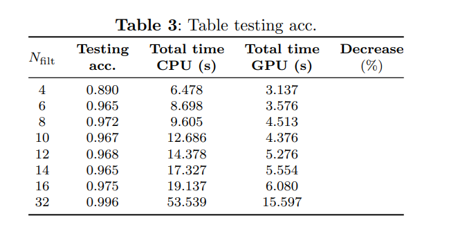

# Oil Palm Tree Detection and Segmentation using U-Net


This project implements a deep learning model based on the **U-Net** architecture for the identification, segmentation, and counting of oil palm trees in high-resolution RGB satellite imagery. Unlike traditional methods that rely on bounding boxes, this approach utilizes pixel-level segmentation to improve precision and computational efficiency.

## 📋 Project Overview

Monitoring oil palm plantations is critical for sustainable agricultural practices, pest management, and ecosystem dynamics. This software processes large-scale orthomosaics using a **block-by-block strategy**, ensuring that high-resolution data can be processed on mid-range hardware without compromising accuracy.

**Key Features:**

* **Architecture:** Modified U-Net encoder-decoder with adjustable filter counts to optimize training time.


* **Input:** High-resolution RGB images ( m spatial resolution).


* **Output:** Segmentation masks and tree counting based on the centroid of each segmented region.


## 💻 Technical Specifications

* **Language:** Python 3.10.


* **Hardware Environment:** AMD Ryzen 5 5600x CPU, 16 GB RAM, and NVIDIA RTX 4060 GPU (8 GB VRAM).


* **Dataset:** 130-hectare plantation in Tibaitatá - Mosquera, Colombia.


* **Image Size:**  pixels.


---

## 🔬 Experiments and Results

### 1. Filter Variation ()

The study evaluated how the number of base filters affects accuracy and training time. While  achieved the highest accuracy, lower configurations (like ) offered an excellent balance for limited hardware.


### 2. Optimizer Comparison

Experiments were conducted keeping model parameters fixed to identify the most efficient optimizer.

* **For :** **RMSprop** and **Adam** reached training accuracies above 99%.


* **For :** **RMSprop** delivered the best performance with 99.74% accuracy.


### 3. Detection Performance (Testing)

Final performance was measured using Precision (P), Recall (R), and Overall Accuracy (OA).



## 🚀 Setup and Usage

1. **Clone the repository:**
```bash
https://github.com/hvargas121288/palm_oil_segmentation_satelital_images

```
2. **Install dependencies:**
```bash
pip install -r requirements.txt

```

3. **Data Preparation:** Images should be in high-resolution RGB format. The model uses a block-wise strategy to handle memory constraints.


4. **Training:** The script allows you to set the N_filt parameter to match your GPU capacity.


## 📝 Authors

* **Hector Miguel Vargas García** - *Universidad Manuela Beltran*.

*  **Ivan Fernando Bohorquez Hernandez** - *Universidad Manuela Beltran*.
  
*  **Sergio Santiago Quimbaya Rodríguez** - *Universidad Manuela Beltran*.

* **Jose Alejandro Betancur Ramirez**.

* **Ariolfo Camacho Velasco** - *AGROSAVIA*.

* **Cesar Augusto Vargas García**.


---
